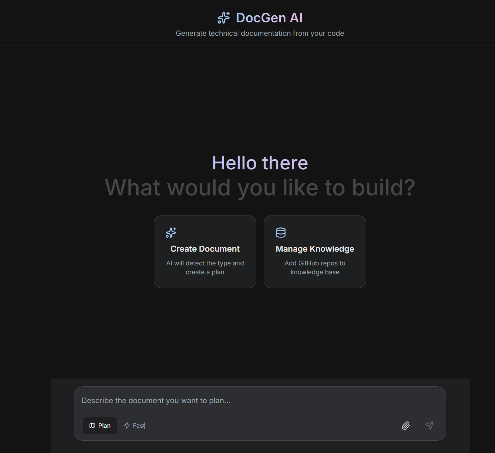
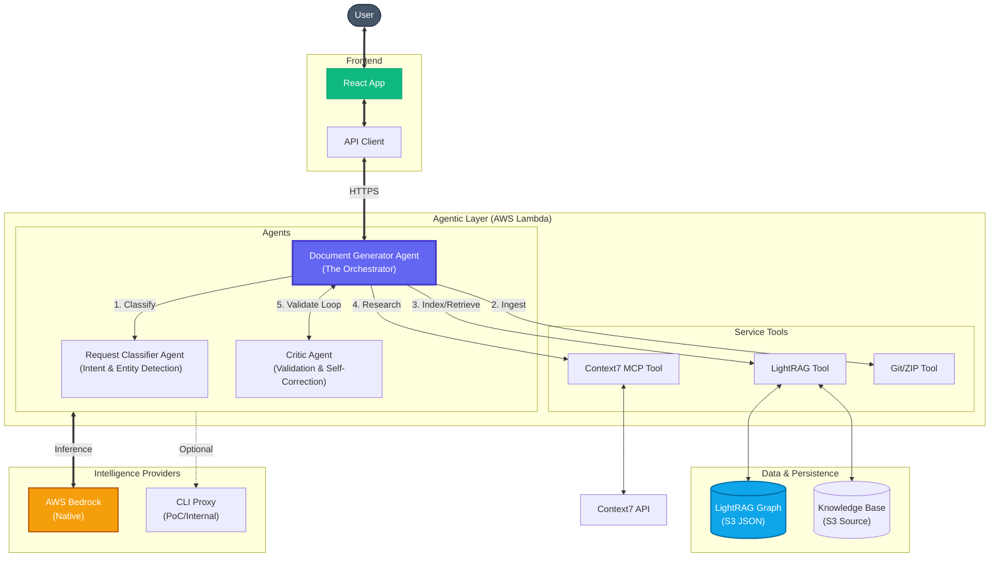

# DocGen AI - Zero-Scale Technical Document Generator

  

**High-Quality Technical Documentation at Lowest Possible Cost**

An AI-powered technical document generator designed for **zero-scale** deployment. It runs entirely on serverless infrastructure (AWS Lambda + S3), costing **$0.00** when idle and scaling infinitely to meet demand.

Integration with **Context7 MCP** and **LightRAG** ensures your documentation is accurate, up-to-date, and context-aware.

---

## 📸 Dashboard Preview



---

## 💡 Core Philosophy: "Zero Scale" & Low Cost

This project is architected to minimize infrastructure costs without sacrificing performance:

1.  **Zero Compute Cost Idle**: Uses **AWS Lambda** with Function URLs. No EC2 instances, no load balancers, no always-on containers. You pay only for the milliseconds used to generate a document.
2.  **Storage as Database**:
    *   **LightRAG Graph**: Stored in **S3** as JSON files.
    *   **Knowledge Base**: Uses **S3** for raw document storage.
    *   **Result**: Practically infinite scale at negligible cost ($0.023/GB) without managing a persistent Vector DB.
3.  **BYO-LLM**: Compatible with **AWS Bedrock** for enterprise-grade security.
    > **Note**: An architectural PoC exists for **CLI Proxy** (using local/free LLMs like Ollama/PrivateGPT), demonstrating zero inference cost potential for internal business units.

---

## 🏗️ Architecture



### Key Components

*   **Backend**: FastAPI running on **AWS Lambda** (Container Image).
*   **Frontend**: Static React app hosted on **AWS S3** (served directly or via CloudFront).
*   **Data Layer**:
    *   **LightRAG**: Graph-based index stored in `LIGHTRAG_S3_BUCKET`.
    *   **Knowledge Base**: Raw documents for RAG stored in `KB_S3_BUCKET`.
*   **Ingestion**: Direct GitHub ZIP download (no git dependency) for fast, serverless-friendly indexing.

---

## 🧠 Technology Decisions

Why we chose this specific stack for the PoC vs. traditional alternatives.

| Component | Choice | Why we chose it (The "Special Sauce") |
|-----------|--------|---------------------------------------|
| **RAG Engine** | **LightRAG** | **Graph > Vectors.** LightRAG builds a knowledge graph from code, understanding *relationships* (Function A calls Function B) better than simple chunk-based vector search. Essential for generating accurate technical specs. |
| **Knowledge Source** | **Context7** | **Maintenance-Free Docs.** Instead of scraping documentation ourselves (which breaks constantly), we stream up-to-date context from Context7's MCP. It's like a CDN for library documentation. |
| **Compute** | **AWS Lambda** | **Zero Idle Cost.** Unlike ECS/Fargate (min \$15/mo), Lambda costs literally \$0.00 until a request hits. Perfect for internal tools with spiky usage. |
| **Database** | **S3 (as DB)** | **Infinite Scale, Zero Cost.** We store the LightRAG graph as JSON in S3. No expensive Vector DB instance (Pinecone/OpenSearch) required. It's slower but practically free and serverless. |
| **Ingestion** | **GitHub ZIP** | **No Git Dependency.** Avoiding `git clone` eliminates complex system dependencies in Lambda, reduces container size, and speeds up "cold" ingestion by processing via stream. |

---

## 💰 Realistic Cost Analysis

While the infrastructure is "Zero Scale", realistic usage involves **Intelligence Costs** (LLM tokens). Costs below are based on `us-east-1` pricing.

### 1. Infrastructure (AWS Lambda + S3)
*Costs are negligible even for heavy usage.*

| Resource | Unit Cost | Active Team Scenario | Monthly Cost |
|----------|-----------|----------------------|--------------|
| **Lambda** (1GB RAM) | \$0.00001667 / sec | ~20 hours processing | **\$1.20** |
| **S3 Storage** | \$0.023 / GB | 1GB Repos + Index | **\$0.02** |
| **S3 Requests** | \$0.0004 / 1k reqs | ~50k requests | **\$0.02** |
| **Data Transfer** | \$0.09 / GB | 5GB Out | **\$0.45** |
| **Total Infra** | | | **~\$1.69 / mo** |

### 2. Intelligence (Bedrock Nova Pro)
*This is the primary cost driver. LightRAG is token-intensive during ingestion.*

*   **Ingestion**: ~250k input tokens / 30k output tokens per medium repo (MBs of code).
    *   *Cost*: ~\$0.30 per repository.
*   **Generation**: ~70k input / 5k output per comprehensive SRS document.
    *   *Cost*: ~\$0.08 per document.

### 3. Total Monthly Estimate (Active Team)
*Scenario: Ingest 20 repos, Generate 100 documents, 500 chat queries.*

| Item | Count | Unit Cost | Total |
|------|-------|-----------|-------|
| **Infrastructure** | 1 month | Fixed | **\$1.69** |
| **Repo Ingest** | 20 repos | ~\$0.30 | **\$6.00** |
| **Doc Gen** | 100 docs | ~\$0.08 | **\$8.00** |
| **Chat** | 500 chats | ~\$0.006 | **\$3.00** |
| **TOTAL (Bedrock)** | | | **~\$18.69 / mo** |

> **💡 Cost Optimization**: An internal FPT PoC demonstrates using **CLIProxy** to leverage existing licenses (PrivateGPT/Copilot), potentially eliminating the Intelligence cost. This feature is currently experimental.

---

## 🚀 Quick Start

### Prerequisites
*   [Python 3.11+](https://www.python.org/) (Project uses `uv`)
*   [Node.js 18+](https://nodejs.org/) (for Frontend)
*   [AWS CLI](https://aws.amazon.com/cli/) (configured with credentials)
*   [Docker](https://www.docker.com/) (for deployment builds)

### 🏎️ Local Development (Hybrid)

Run the system on your machine, utilizing AWS Bedrock for intelligence.

#### 1. Backend Setup

```bash
# Install uv (if needed)
pip install uv

# Create environment and install dependencies
uv venv .venv
# Activate: 
# Windows: .\.venv\Scripts\activate
# Mac/Linux: source .venv/bin/activate

uv sync
```

**Configuration (.env):**
```env
# Required for AWS Bedrock
LLM_PROVIDER=bedrock
BEDROCK_REGION=us-east-1

# Required for Data Persistence implies existing buckets
LIGHTRAG_S3_BUCKET=your-lightrag-bucket
KB_S3_BUCKET=your-kb-bucket
```

**Run Server:**
```bash
uvicorn app.main:app --reload
```

#### 2. Frontend Setup

```bash
cd frontend
npm install
npm run dev
```

Open [http://localhost:3000](http://localhost:3000) to view the dashboard.

---

## 🚀 Deployment Options

### Zero-Scale AWS Deployment (Recommended)

Full serverless deployment using Terraform.

**Steps:**

1.  **Build & Push Docker Image:**
    ```bash
    # (See detailed steps in aws/README.md)
    aws ecr get-login-password | docker login...
    docker build -t tech-doc-generator -f Dockerfile.lambda .
    docker push ...
    ```

2.  **Deploy Infrastructure:**
    ```bash
    cd aws/terraform
    terraform init
    terraform apply
    ```
    This will output your `Frontend URL` and `API URL`.

---

## 📁 Repository Structure

```
├── app/
│   ├── api/            # Routes (v1/generate, v1/ingest)
│   ├── core/           # Config, Logging, LLM Factory
│   ├── services/       # Logic (LightRAG, GitIngest, Context7)
│   └── schemas/        # Pydantic models
├── aws/
│   └── terraform/      # Infrastructure as Code (Zero Scale)
├── frontend/           # React Application
├── prompts/            # .prompty Templates
└── Dockerfile.lambda   # Production Container Spec
```

## 📝 License

MIT
